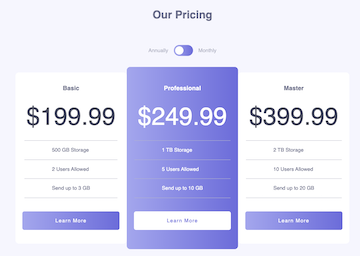
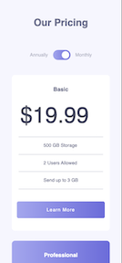

# Pricing component with toggle solution

This is a solution to the [Pricing component with toggle challenge on Frontend Mentor](https://www.frontendmentor.io/challenges/pricing-component-with-toggle-8vPwRMIC).

## Table of contents

- [Overview](#overview)
  - [The challenge](#the-challenge)
  - [Screenshot](#screenshot)
  - [Links](#links)
- [My process](#my-process)
  - [Built with](#built-with)
  - [What I learned](#what-i-learned)
  - [Continued Development](#continued-development)
  - [Useful resources](#useful-resources)
- [Author](#author)

## Overview

### The challenge

Users should be able to:

- View the optimal layout for the component depending on their device's screen size

### Screenshot

 

### Links

- Github Repo URL: [Pricing Component Vite Repo](https://github.com/amyspencerproject/pricing-component)
- Live Site URL: [Pricing Component Vite Page](https://pricing-component-vite-q1sr4xn4k-amyspencerproject.vercel.app/)

## My process

### Built with

- Semantic HTML5 markup
- CSS
- Mobile-first workflow
- [React](https://reactjs.org/) - JS library
- [Vite](https://vitejs.dev/) - React framework

### What I learned

- Made a checkbox toggle with a horizontal slider with CSS! Tried to make this as accessbile as possible, even used `will-change: transform;` on the toggle handle.
- Using Vite! Trying to give up using Create React App and Vite so far has a shallow learning curve 🥳.
- Could not use the HTML entity `&dollar;` with Vite. I had to switch to `&#36;` which is ASCII. Other HTML entities worked just fine like `&amp`; and `&times;`. I could not find a clear answer as to why.
- Used React Hooks in this component
- Deployed by pushing code to Github and then deploying in Vercel. There were a lot of options with Vite. I like to keep my Githup repos in sync with any live url links I have out there in the universe. Vercel knew that I had used Vite to build this component making deployment super easy.

### Continued development

- Control the toggle with both their mouse/trackpad and their keyboard

### Useful resources

- [Accessible Toggle](https://kittygiraudel.com/2021/04/05/an-accessible-toggle/) - Excellent article on how to build an accessible toggle from a checkbox.
- [Vite documentation](https://vitejs.dev/guide/) - The documentation for Vite is very clear
- [Setting up React on Vite ](https://www.makeuseof.com/set-up-react-app-with-vite/)

## Author

- Website - [Amy Spencer](https://spencerproject.com/)
- Frontend Mentor - [@amyspencerproject](https://www.frontendmentor.io/profile/amyspencerproject)
- Linkedin - [amyspencercodes](https://www.linkedin.com/in/amyspencercodes/)
